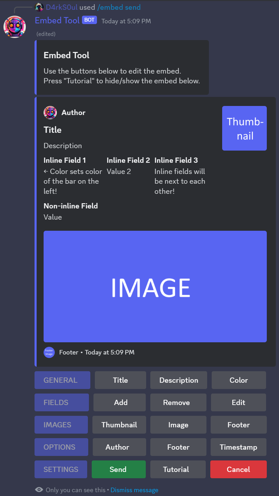
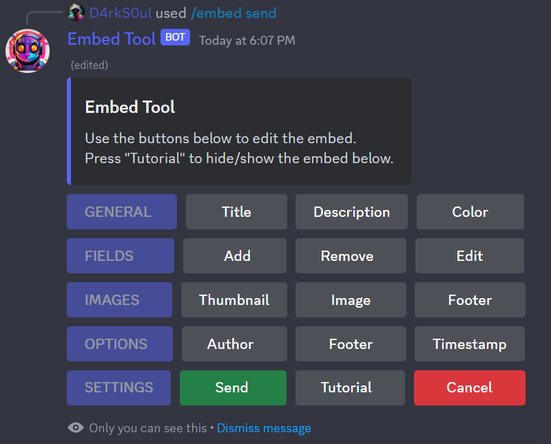

# EmbedTool
- Easily send and edit embeds in discord using the intuitive button controls!

## Features
- Send or edit embeds using the buttons below.
- 
- Hide the tutorial for a more compact view.
- 

## License
- The code or parts of the code may only be used in opensource projects. 
- Any commercial use of the code is prohibited.
- Credit must be given to both [me (https://github.com/D4rk-S0ul)](https://github.com/D4rk-S0ul) and [Ted-18 (https://github.com/Ted-18)](https://github.com/Ted-18) when using or editing the code.
- Additionally the GPL-3.0 license applies.

## Acknowledgements
- [@Ted-18](https://github.com/Ted-18) for coming up with the origial idea and layout of the Embed Tool
